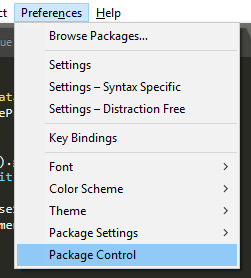
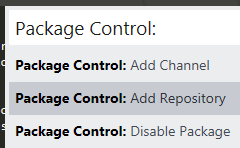
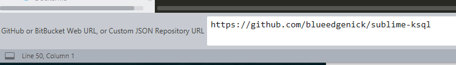
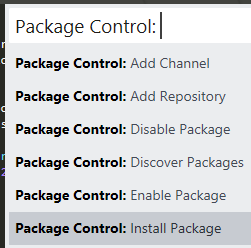
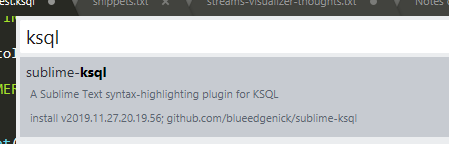
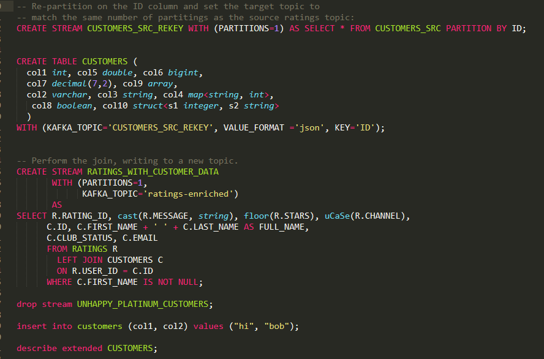

Sublime Text KSQL Syntax Definition
===================================

A Sublime Text 3 syntax-highlighting plugin for Confluent's [KSQL](https://www.confluent.io/product/ksql) [ksqlDB](https://ksqldb.io/)

Tested to work with Confluent Platform ("CP") 5.3+ and ksqlDB 0.6+

### Installation

#### With [Package Control](http://wbond.net/sublime_packages/package_control):

The maintainer of the official Package Control repo seems missing-in-action, no PRs merged for several months now, so we have to do one extra step to inform your Package Control installation about this repo.

1. In Sublime Text, open Package Control from the Preferences Menu

2. Select `Package Control: Add Repository`

3. At the bottom of the Sublime window, an input box will appear. Paste the URL of this github repo (`https://github.com/blueedgenick/sublime-ksql`); hit Enter.

4. Now the repo has been added to Package Control but the actual plugin is not yet installed.

Open Package Control again and select `Package Control: Install Packages`

5. Now you should be able to search for, and install, the `KSQL Syntax Highlighting` plugin.

6. Restart Sublime Text editor (if required)

### Usage

Open a file containing some KSQL commands and change the syntax to `SQL (KSQL)`.

For files with a `.ksql` extension, this syntax should be selected automatically.

### Example

